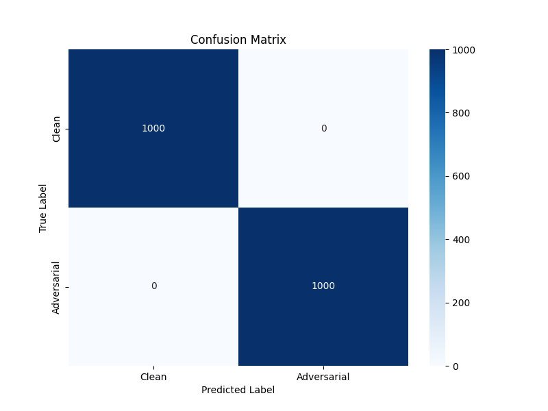
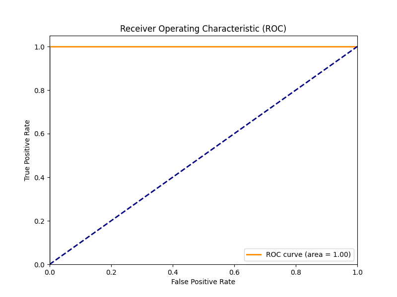

# Adversarial AI Defense

## What is the problem?

Machine learning models, particularly deep neural networks, are vulnerable to **adversarial attacks**. These are subtle perturbations to input data (like an image) that are imperceptible to humans but cause the model to make confident, incorrect predictions. This poses a significant security risk in safety-critical applications like autonomous driving, facial recognition, or medical diagnosis.

## What does this project do?

This project demonstrates a complete end-to-end pipeline for understanding and mitigating these threats:

1.  **Training**: We train a standard Convolutional Neural Network (CNN) on the MNIST digit dataset.
2.  **Attacking**: We use the Fast Gradient Sign Method (FGSM) and Projected Gradient Descent (PGD) to generate adversarial examples—images that look normal to us but completely confuse the model.
3.  **Defending**: We implement a statistical anomaly detector that analyzes image statistics (mean, standard deviation, etc.) to flag and block potential adversarial inputs before they are processed by the model.

## How do I run it?

### Prerequisites

- Python 3.8+
- `pip`

### Installation

1.  Clone the repository:
    ```bash
    git clone https://github.com/spyduck007/AdversarialAIDefense.git
    cd AdversarialAiDefense
    ```
2.  Install dependencies:
    ```bash
    pip install -r requirements.txt
    ```

### Usage

We provide a simple CLI tool (`cli.py`) to manage the entire pipeline.

#### 1. Train the Model

First, train the CNN on the MNIST dataset. This will save the model to `models/mnist_cnn.pt`.

```bash
python cli.py train --epochs 5
```

#### 2. Generate Attacks

Generate adversarial examples using FGSM or PGD. This creates a dataset of attacked images in `data/processed/`.

```bash
# For FGSM (default)
python cli.py attack --eps 0.3 --type fgsm

# For PGD (stronger iterative attack)
python cli.py attack --eps 0.3 --type pgd
```

_Note: `eps` (epsilon) controls the strength of the attack. Higher values make the attack more effective but more visible._

#### 3. Evaluate Defense

Train the anomaly detector on the clean and adversarial data, and evaluate its performance.

```bash
# Evaluate against FGSM
python cli.py defend --type fgsm

# Evaluate against PGD
python cli.py defend --type pgd
```

## Demo Video

[Watch the Demo Video Here](https://example.com/placeholder-video-link)

## Results

When you run the defense evaluation, you will see:

1.  **Attack Success Rate (ASR)**: How effective the attack was against the unprotected model.
2.  **Classification Report**: Precision/Recall for the anomaly detector.
3.  **Generated Plots**: Saved to `results/` directory.

### Visualizations (PGD Attack)

| Confusion Matrix | ROC Curve |
|:---:|:---:|
|  |  |

_These plots demonstrate the detector's ability to distinguish between clean and perturbed images._

**Example Output:**

```text
Calculating Attack Success Rate...
Clean Accuracy: 0.9920
Adversarial Accuracy: 0.0000
Attack Success Rate: 1.0000

Training anomaly detector on 1000 clean and 1000 adversarial samples...

Plotting ROC Curve...
ROC AUC: 0.9998

Classification Report for Anomaly Detector:
              precision    recall  f1-score   support

       Clean       1.00      0.98      0.99      1000
 Adversarial       0.98      1.00      0.99      1000

    accuracy                           0.99      2000
   macro avg       0.99      0.99      0.99      2000
weighted avg       0.99      0.99      0.99      2000
```

This indicates that our simple statistical defense is highly effective against basic FGSM attacks on MNIST. PGD attacks may prove more challenging or require different detection thresholds.

## Limitations & Things to Consider

- **Dataset Simplicity**: This project uses MNIST (grayscale digits). Defenses that work well here often struggle with complex, high-dimensional datasets like ImageNet or CIFAR-10.
- **Attack Specificity**: We demonstrate defense against FGSM and PGD. While PGD is stronger, adaptive attacks (C&W) might still bypass this defense.
- **Adaptive Attacks**: This is a static defense. If a sophisticated attacker knows you are using an anomaly detector, they can modify their attack to fool both the classifier _and_ the detector simultaneously.
- **False Positives**: In a real-world system, blocking legitimate users (false positives) can be just as bad as letting attacks through. The threshold for detection needs to be carefully tuned.

---

_Created for educational purposes to demonstrate adversarial machine learning concepts._
